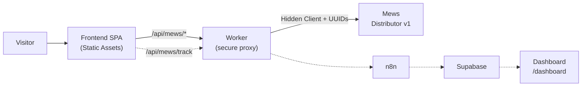
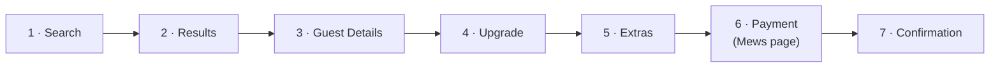
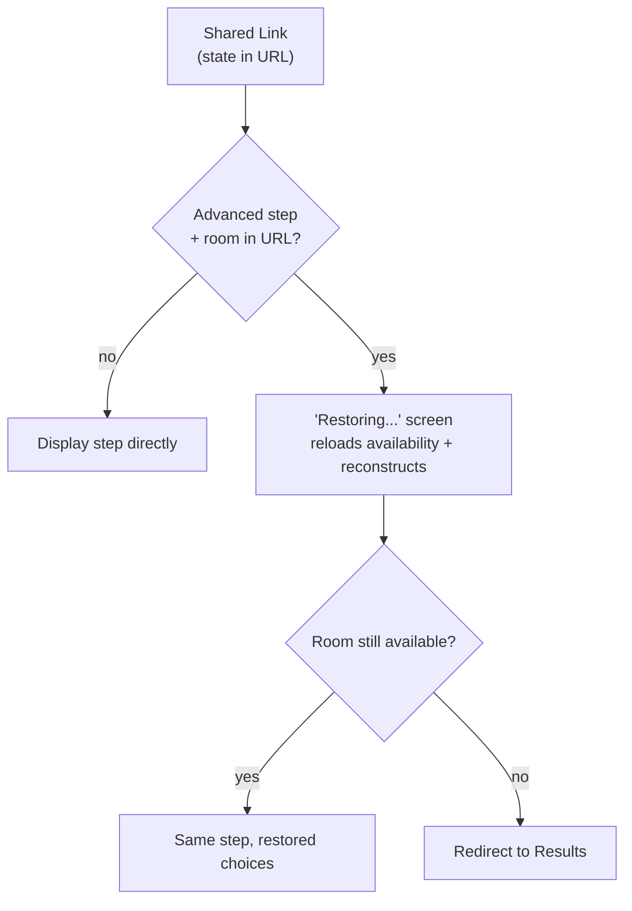
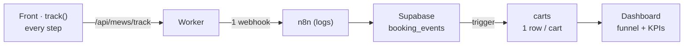

# Urban Cowboy — Technical & Business Guide

> Flow map and decision guide — technical and business — so that anyone joining the
> project immediately knows whether an observed behavior is **intended**, a
> **subtlety to be aware of**, or a **real bug**.
> Stack: **Cloudflare Worker + React/Vite** · PMS: **Mews Distributor v1** · Analytics: **n8n → Supabase**

## Table of Contents

1. [Overall Architecture](https://www.google.com/search?q=%231-overall-architecture)
2. [The Booking Funnel](https://www.google.com/search?q=%232-the-booking-funnel)
3. [Multi-Property (3 Mews Configs)](https://www.google.com/search?q=%233-multi-property--3-mews-configurations)
4. [Languages FR / EN](https://www.google.com/search?q=%234-languages--fr--en)
5. [Shareable Links & Rehydration](https://www.google.com/search?q=%235-shareable-links--rehydration)
6. [Analytics Pipeline](https://www.google.com/search?q=%236-analytics-pipeline)
7. [Intended, or Bug?](https://www.google.com/search?q=%237-intended-or-bug)
8. [Real Data (Mews) vs. Demo (Hardcoded)](https://www.google.com/search?q=%238-real-data-mews-vs-demo-hardcoded)
9. [Tools, Locations & Accounts](https://www.google.com/search?q=%239-tools-locations--accounts)

---

## 1. Overall Architecture

The frontend **never** talks directly to Mews. Everything goes through Worker functions
on the same origin (`/api/mews/*`). This single boundary hides the `Client` token and
property UUIDs, and cleans up Mews responses (≈ 80 currencies → EUR only).

*Solid line = direct booking · dotted line = analytics tracking (asynchronous, best-effort).*

---

## 2. The Booking Funnel

Seven steps. State lives in **URL parameters** (dates, properties, room, rate,
extras, step, language) — making every link shareable and replayable. Payment is
delegated to the **Mews-hosted page** (card + 3-D Secure), with a return redirect to
`/confirmation`.

> Analytics tracking emits a `step` event at **every** step (starting from search),
> plus `paiement_initie` (payment initiated) and `paiement_valide` (payment validated). This feeds the dashboard funnel.

---

Important consequence: in Mews, a **product (extra) belongs to a single configuration**.
Booking a Room with a breakfast is rejected by Mews
(`product invalid`). The engine therefore filters extras based on the property of the
selected room at step 2.

> A category returned by availability but **missing from the catalog** `configuration/get`
> (lacking name or photo) is deliberately **hidden** rather than displayed as an empty card.

---

## 4. Languages — FR / EN

Language is controlled via `?lang=fr|en` (or the footer language picker, which reloads the page
to re-localize everything). It is sent to Mews (`LanguageCode`) — which also sets the
language for the **payment page** and transactional emails.

---

## 5. Shareable Links & Rehydration

Because complete state is kept in the URL, users can share their selection: the recipient
arrives at the **exact same step** with the same choices. When opening a deep link, the
engine briefly displays a "Restoring..." screen, reloads availability, and reconstructs
the room/rate *before* rendering the step (to prevent invalid redirects).

> **⚠️ Good to know —** deliberate choice: **guest contact details** (name, email,
> phone) are included in the URL to restore input fields. Consequently, they are visible
> in browser history, server logs, and to anyone receiving the link — this should be addressed in the privacy policy.

---

## 6. Analytics Pipeline

At every step, the frontend pushes an event to a **single n8n endpoint** (via the
Worker for logging), which inserts it into Supabase. A Postgres **trigger** aggregates each
event into a `carts` table (one row per cart) read by the dashboard.

**Atomicity:** Inserting into `booking_events` and updating `carts` form **a single transaction**.
If the trigger fails, everything is rolled back (nothing is saved) — guaranteeing that an
event is never stored without updating its cart.

> "Unsuccessful payment" is not an event sent by the front: it is **derived** = `payment_valid`
> without `payment_valid`. However, `payment_valid` is only emitted if the customer **returns** to
> the confirmation page. Reliable validation is thus handled on the n8n side, which calls Mews using
> the `reservationGroupId` present in the event.

---

## 7. Intended, or Bug?

Keep this table handy when onboarding on the project.
**✅ Intended** = expected behavior · **⚠️ Good to know** = accepted side effect · **❌ Bug** = abnormal behavior.

| Observed Behavior | Status | Why |
| --- | --- | --- |
| Room names remain in French in English mode | ✅ Intended | Mews content entered in FR only. Interface is translated, PMS catalog is not. |
| No villas (nor "Villas" accordion) on certain dates | ✅ Intended | Zero villa availability for those dates. Accordion only appears if availability exists. |
| An extra appears for one room but not another | ✅ Intended | Extras are attached to a specific Mews config; only extras from the room's property are shown. |
| "€0 fees and commission" displayed on all rates | ✅ Intended | API does not allow checking refundability per rate: we display the safe messaging (direct booking, zero platform commission). |
| Shared link falls back to "Results" instead of step | ⚠️ Good to know | Normal *if* room is no longer available on those dates. Otherwise (room available), it is a rehydration bug. |
| Email / phone visible in URL | ⚠️ Good to know | Intentional choice for cart sharing/resumption. Personal data in URL → needs coverage under GDPR policy. |
| Brief "Restoring your selection..." screen | ✅ Intended | Deep-link rehydration: reloads availability before displaying the step. |
| Paid cart appears as "unsuccessful" in dashboard | ⚠️ Good to know | Customer did not return to `/confirmation` → `payment_valid` not emitted. n8n must validate via Mews (`reservationGroupId`). |
| `booking_events` empty after a 400 trigger error | ✅ Intended | Atomic transaction: if trigger fails, insert is rolled back. Guarantees consistency. |
| `/dashboard` displays "needs configuration" | ✅ Intended | Supabase anon key missing from `config.ts`. Once provided → login screen. |
| A "bookable" room does not appear in list | ✅ Intended | Category present in availability but missing from catalog `configuration/get` (lacks name/photo) → hidden. |

---

## 8. Real Data (Mews) vs. Demo (Hardcoded)

Several reassurance elements are **generated**, not sourced from Mews. Good to know before
"debugging" a number that changes on its own. **🟢 Real** = comes from Mews · **🟣 Demo** = hardcoded, to be replaced.

| Displayed Element | Source | Details |
| --- | --- | --- |
| Availability, pricing, rates | 🟢 Real | Mews `getAvailability` / `getPricing`, curated in EUR. |
| Room names, descriptions, photos | 🟢 Real | Mews `configuration/get`. |
| "Only N rooms left" | 🟢 Real | Based on Mews `AvailableRoomCount`. |
| Terms & Conditions (link) | 🟢 Real | URL provided by Mews configuration. |
| Rating "4.2 · 2,064 reviews" | 🟣 Demo | Hardcoded. To be connected to a real review source. |
| "14 people viewing this stay" | 🟣 Demo | Generated (seeded per room), not a real counter. |
| "Booked N times this week" | 🟣 Demo | Generated. Illustrative social proof. |
| "Guest Favorite" / "High Demand" | 🟣 Demo | Illustrative badges (simple rule / seed), not a Mews signal. |
| Timer "We hold your room for 10 min" | 🟣 Demo | Urgency visual; no actual temporary reservation on Mews. |

---

## 9. Tools, Locations & Accounts

> ⚠️ This table lists **where** things live, **never secrets** (the repo is public).
> This repository contains demo defaults only. Project-specific accounts and identifiers must be provisioned separately.

| Tool | Role | Where (console) | Account |
| --- | --- | --- | --- |
| **GitHub** | Source code | `REVREBEL/urban-cowboy-booking-engine` | REVREBEL |
| **Cloudflare Workers** | Hosting + deployment | Provision for this project | Not configured in this repository |
| **Mews** | PMS / availability / pricing / payment | Public demo API by default | Production account not configured |
| **n8n** | Optional funnel tracking | Provision for this project | Not configured |
| **Supabase** | Optional database + Auth + API | Provision for this project | Not configured |

### Key URLs

| What | URL |
| --- | --- |
| Booking Engine (Prod) | 
| Back-Office Dashboard | `/dashboard` on the deployed project origin |
| Tracking Endpoint → n8n | Not configured |
| Supabase API (REST auto) | Not configured |

### Deployment

No manual deployment: **push to `main` → Cloudflare Workers Builds** automatically rebuilds and
deploys (front + Worker on the same origin, ~1 min). The dashboard is a 2nd page of the
same build (`/dashboard`).

### Where Secrets Live (Never in the Repo)

| Secret | Role | Location |
| --- | --- | --- |
| `MEWS_CLIENT` | Mews Distributor Token | `.dev.vars` (local) **+** Cloudflare Secret (prod) |
| Supabase `service_role` | Full database access (bypasses RLS) | **Only** in n8n credentials |
| Supabase `anon` (public) | Frontend read via RLS + Auth | `src/dashboard/config.ts` (public by design) |
| Public Mews IDs + `WEBHOOK_EVENTS` | Non-secrets (hotel/config/age categories) | Deployment environment; repository values are demo-only |

### Reception Contact (Displayed in the Booking Engine)

The repository uses non-routable demo contact details. Replace them with property-owned values in `src/components/ContactBar.tsx` before production use.

---

*Onboarding document — update whenever a rule changes (ideally in the same commit as the related code). If unsure about an unlisted behavior: consider it **to be investigated**, not intended.*
